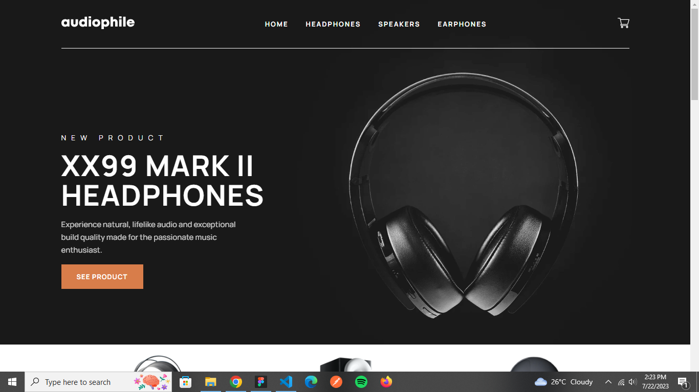
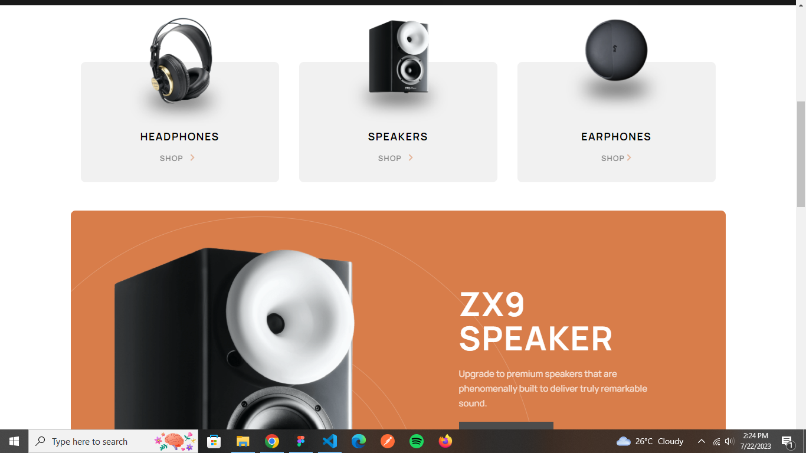
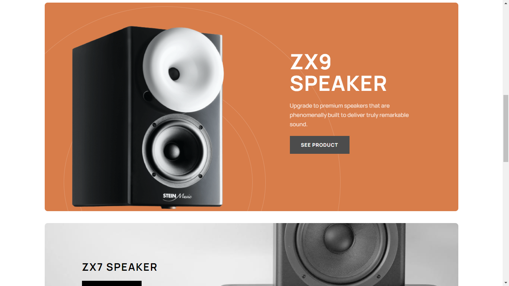
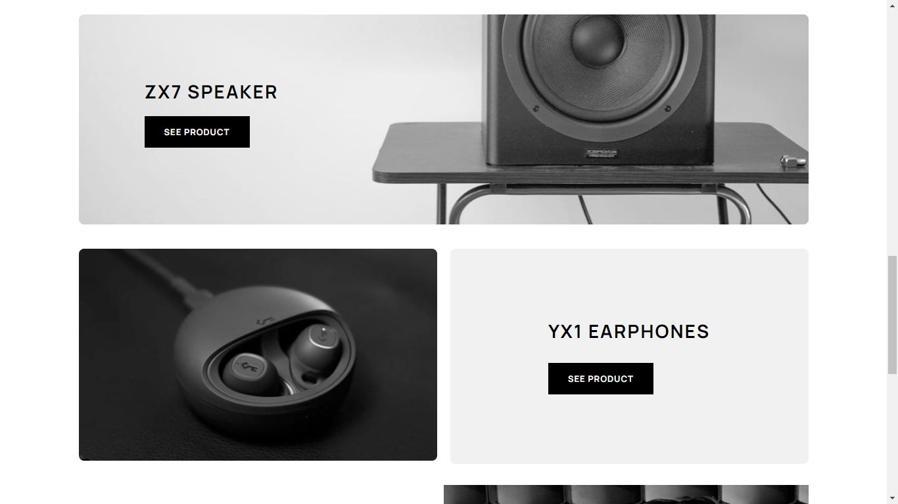
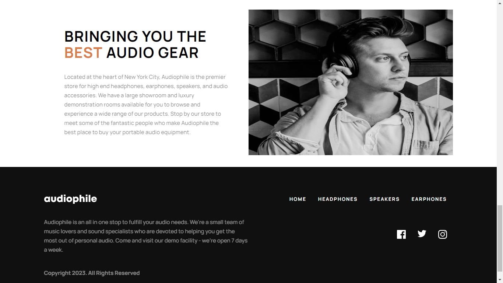
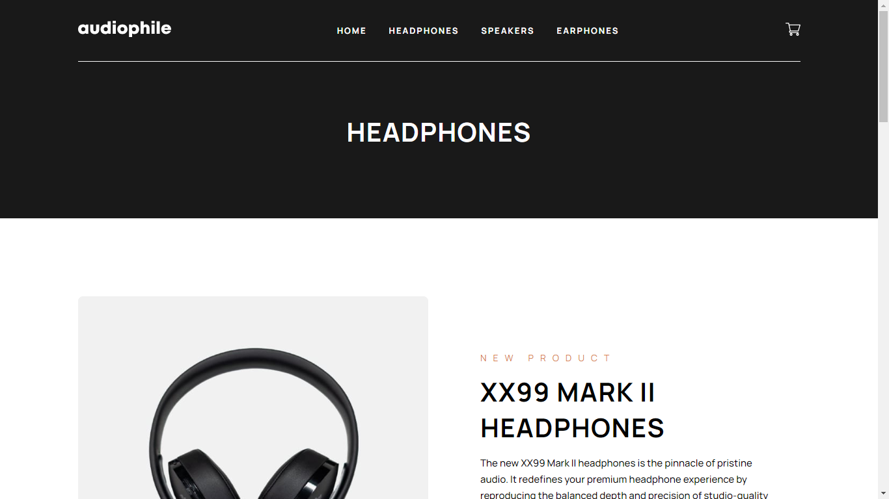
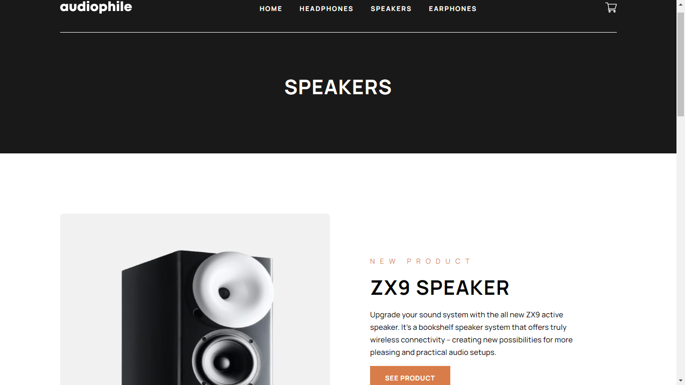
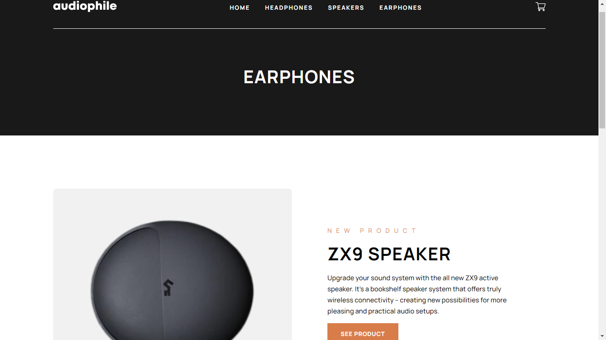
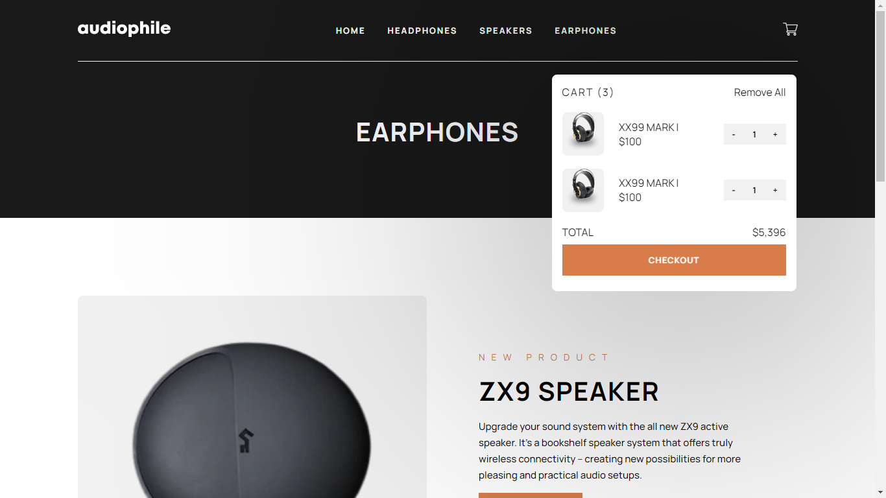
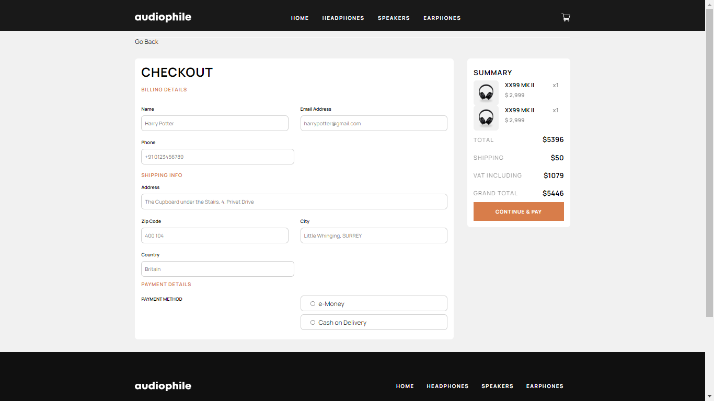

# Frontend Mentor - Audiophile e-commerce website solution

This is a solution to the Audiophile e-commerce website challenge on Frontend Mentor (https://www.frontendmentor.io/challenges/audiophile-ecommerce-website-C8cuSd_wx). Frontend Mentor challenges help you improve your coding skills by building realistic projects.

## Table of contents

- [Overview](#overview)
  - Audiophile e-commerce website challenge on Frontend Mentor
  - [Screenshot](#screenshot)
  - [Links](#links)
- [My process](#my-process)
  - [Built with](#built-with)
- [Author] Aditya Ashok Mane

**Note: Delete this note and update the table of contents based on what sections you keep.**

## Overview

### The challenge

Users should be able to:

- View the optimal layout for the app depending on their device's screen size
- See hover states for all interactive elements on the page

following things are yet to be done

<!-- - Add/Remove products from the cart -->
<!-- - Edit product quantities in the cart -->
<!-- - Fill in all fields in the checkout -->
<!-- - Receive form validations if fields are missed or incorrect during checkout -->
<!-- - See correct checkout totals depending on the products in the cart -->
  <!-- - Shipping always adds $50 to the order -->
  <!-- - VAT is calculated as 20% of the product total, excluding shipping -->
<!-- - See an order confirmation modal after checking out with an order summary -->
<!-- - **Bonus**: Keep track of what's in the cart, even after refreshing the browser (`localStorage` could be used for this if you're not building out a full-stack app) -->

### Screenshot

### Links

- Solution URL:  
- Live Site URL: https://your-live-site-url.com](https://loquacious-jalebi-f2779c.netlify.app/

### Built with

- Semantic HTML5 markup
- CSS custom properties
- Flexbox
- CSS Gridw
- [React](https://reactjs.org/) - JS library
- [react-router-dom](https://reactrouter.com/en/main) - Routing

## Author

- Website - [Aditya Ashok Mane]
- Frontend Mentor - @Aditya-Mane007(https://www.frontendmentor.io/profile/Aditya-Mane007)
- Twitter - [@AdityaM52821612](https://twitter.com/AdityaM52821612)
